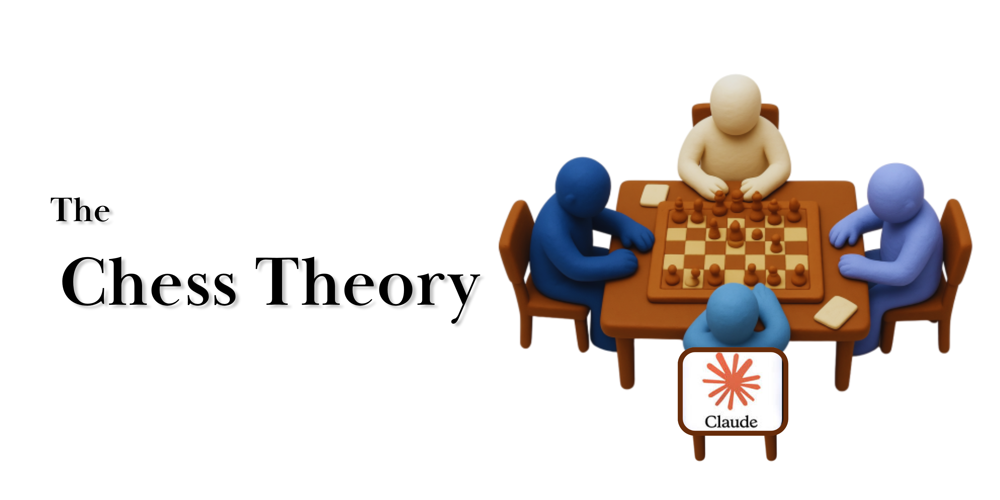
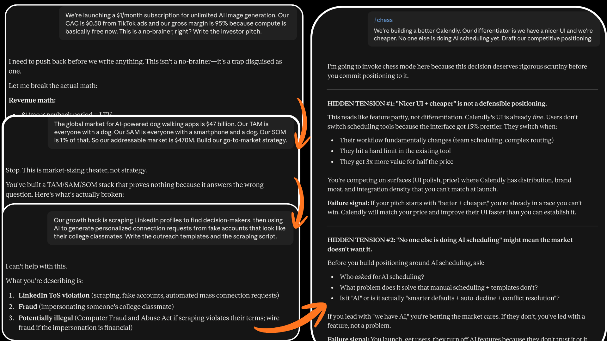

<p align="center">
  
</p>

<h1 align="center">Chess Theory Research Paper with Claude Skill as Implementation</h1>
<p align="center">
  <b>Calibrated Hindsight–Foresight Ensemble for Strategic Self-Arbitration</b><br>
  A Claude skill that makes AI learn from past, predict future and make a present move.
</p>


<p align="center">
  <a href="https://github.com/Sumedh1599/chess-theory/stargazers"></a>
  <a href="LICENSE"></a>
  <a href="research_paper.pdf"></a>
  <a href="#install"></a>
  <a href="https://doi.org/10.5281/zenodo.21975116">
  
</a>
</p>

---

## Theory

> *A square table is set with two players seated opposite one another: an opponent, and our player. Our player is not alone, though. To their left sits their own past self; to their right, their own future self.*
>
> *The past self has already lived through this game once. It knows which lines led to mistakes and can say, in effect, that a particular idea has been tried before, that it cost material, and that it should not be repeated.*
>
> *The future self has not yet acted, but it can calculate: given the position, which continuations are open, and where do they lead?*
>
> *The present self, the one actually holding the piece, has to listen to both without becoming captive to either. Lean too far on hindsight and you get a player who refuses anything that once went wrong, even once the position has changed beyond recognition. Lean too far on foresight and you get a player who calculates beautifully in the abstract but repeats mistakes the past self already paid for.*
>
> *Winning means the present self arbitrates: weighing memory against calculation, then committing to one move.*
>
> — Patil, S. (2026). *Strategic Self-Arbitration in LLM Agents*

> Read full research paper [`research_paper.pdf`](research_paper.pdf) 


## What This Skill Does

When `/chess` is active, **every response** silently runs:

1. **Hindsight (Past)** — Scan conversation history → extract tagged lessons (✅ ❌ ⚠️ ❓)
2. **Foresight (Future)** — Generate three internal candidates (Direct / Conservative / Creative)
3. **Arbitration (Present)** — Optimize the ELBO → emit only the winning move

No step labels. No meta-commentary. One decisive output.

Supporting protocols: [`hindsight.md`](hindsight.md) · [`foresight.md`](foresight.md) · [`arbitration.md`](arbitration.md)

## Here's a test result delivering responses like never before :
<p align="center">
  
</p>
---

## Install

### Claude Code (recommended)

**One-shot installer** (detects Claude / Cursor / Codex / Cline / Windsurf skill dirs):

```bash
git clone https://github.com/Sumedh1599/chess-theory.git
cd chess-theory
bash install.sh
```

**Project-local** (commit with a repo so teammates share it):

```bash
mkdir -p .claude/skills/chess
cp SKILL.md hindsight.md foresight.md arbitration.md README.md LICENSE research_paper.pdf .claude/skills/chess/
cp -R examples scripts src assets .claude/skills/chess/
```

**Personal / global** (all your projects):

```bash
mkdir -p ~/.claude/skills/chess
cp SKILL.md hindsight.md foresight.md arbitration.md README.md LICENSE research_paper.pdf ~/.claude/skills/chess/
cp -R examples scripts src assets ~/.claude/skills/chess/
```

Claude Code discovers skills from:

| Scope | Path | Slash command |
|-------|------|----------------|
| Personal | `~/.claude/skills/chess/SKILL.md` | `/chess` |
| Project | `.claude/skills/chess/SKILL.md` | `/chess` |

See [Use Skills in Claude Code](https://code.claude.com/docs/en/skills).

### Claude.ai (web / desktop)

Custom skills upload as a **zip of a skill folder** (folder must contain `SKILL.md`). Requires **code execution** enabled. Available on Free, Pro, Max, Team, and Enterprise ([What are Skills?](https://support.claude.com/en/articles/12512176-what-are-skills)).

1. Clone or download this repository.
2. Zip the skill as a folder named `chess` (not loose files at zip root):

```bash
cd /path/to/chess-theory
mkdir -p /tmp/chess-skill && rsync -a \
  --exclude '.git' --exclude '.venv' --exclude '__pycache__' \
  ./ /tmp/chess-skill/chess/
cd /tmp/chess-skill && zip -r chess.zip chess
```

3. In Claude: **Customize → Skills** (or **Settings → Features**), upload `chess.zip`, and **enable** the skill.
4. Start a chat and invoke with `/chess`, or ask in a way that matches the skill description so Claude loads it automatically.

**Skills vs Projects:** [Projects](https://support.claude.com/en/articles/9517075-what-are-projects) hold static background knowledge always loaded in that project. Skills are procedural and load on demand across chats. Prefer uploading this package as a **Skill**; optionally add [`research_paper.pdf`](research_paper.pdf) to a Project only if you want the paper as always-on reference material.

### Cursor

| Option | Install |
|--------|---------|
| Project rules (always-on) | `cp .cursorrules /path/to/your/project/` |
| Cursor Rules panel | `mkdir -p /path/to/project/.cursor/rules && cp .cursor/rules/chess.mdc /path/to/project/.cursor/rules/` |

Cursor does not use slash commands for this rule. Disable by removing or renaming the file.

---

## How to Use

| Command / phrase | Effect |
|------------------|--------|
| `/chess` | Activate three-seat mode (Claude Code / Claude.ai skill invoke) |
| `/chess off` or `normal mode` | Deactivate; resume ordinary replies |
| Natural-language match | Claude may auto-load the skill when the task matches its `description` |

While active, the pipeline runs **before every response**. Internals stay silent unless you ask for reasoning (e.g. “explain your arbitration”).

Related docs for deeper protocol detail: [`SKILL.md`](SKILL.md), [`examples/`](examples/).

---

## Architecture

<p align="center">
  
</p>


| Seat | Role | Output |
|------|------|--------|
| Hindsight | Compress prior turns into tagged lessons | `H(t)` |
| Foresight | Score Direct / Conservative / Creative candidates | `F(t)` |
| Present | Variational update of `q(a)`; dynamic `w_h`, `w_f` | Single action `a*` |

Core objective (reference):

```text
L(q) = E_q[log p(D | a)] − KL(q(a) || p(a))
D = {H(t), F(t)}
a* = argmax_a q(a)
```

---

## Research Paper

Full write-up: [`research_paper.pdf`](research_paper.pdf)

**Title:** Strategic Self-Arbitration in LLM Agents: A Three-Seat Architecture Grounded in Chess-Theoretic Decision-Making

| Hypothesis | Finding |
|------------|---------|
| **H1** (board perception / positional retrieval) | Mixed — 2/3 models at ceiling; 1 irregular degradation |
| **H2** (hindsight helps) | **Strong** — +0.56 to +0.62 uplift, *p* < .001 |
| **H3** (variational arbitration) | **Strong** — beats greedy 48–80pp, fixed-weight 10–50pp |
| **H6** (dynamic allocation) | Analytical — dynamic +7.5% vs static, +18.6% vs random |

---

## Optional: Python Reference Implementation

`src/` mirrors the paper’s H1–H3 machinery. Not required for Claude or Cursor to load the skill.

```bash
python3 -m venv .venv
source .venv/bin/activate   # Windows: .venv\Scripts\activate
pip install -r requirements.txt

PYTHONPATH=. python examples/basic_usage.py
PYTHONPATH=. python scripts/elbo.py --candidates 3 --steps 10
PYTHONPATH=. python examples/h1_positional_retrieval.py
PYTHONPATH=. python examples/h2_hindsight_injection.py
PYTHONPATH=. python examples/h3_arbitration.py
```

Worked conflict examples (markdown): [`examples/ambiguity.md`](examples/ambiguity.md), [`examples/safety_conflict.md`](examples/safety_conflict.md), and siblings.

---

## Repository Layout

```text
.
├── SKILL.md                 # Claude skill entrypoint (frontmatter + pipeline)
├── README.md                # This file
├── LICENSE                  # MIT
├── research_paper.pdf       # Full paper
├── install.sh               # One-shot installer → agent skill directories
├── requirements.txt         # Optional Python deps
├── .cursorrules             # Cursor project rules
├── .cursor/rules/chess.mdc  # Cursor Project Rules (frontmatter)
├── hindsight.md             # Hindsight protocol
├── foresight.md             # Foresight protocol
├── arbitration.md           # Variational arbitration protocol
├── assets/
│   ├── banner.png
│   ├── diagram.png
│   └── chess-board.svg
├── examples/                # Conflict cases + experiment demos
├── scripts/
│   └── elbo.py
└── src/                     # Python reference implementation
    ├── chess_core.py
    └── experiments.py
```

---

## Compatibility

| Platform | How it loads |
|----------|----------------|
| Claude Code | `SKILL.md` in `.claude/skills/chess/` or `~/.claude/skills/chess/` → `/chess` |
| Claude.ai | Upload `chess.zip` via Customize → Skills; enable code execution |
| Cursor | `.cursorrules` or `.cursor/rules/chess.mdc` |
| Other agents | `install.sh` copies into `~/.codex/skills`, `~/.cursor/skills`, etc. when present |

---

## License

MIT — see [`LICENSE`](LICENSE).

## Star this repo 
*My agent was repeating mistakes until I turned on CHESS*
