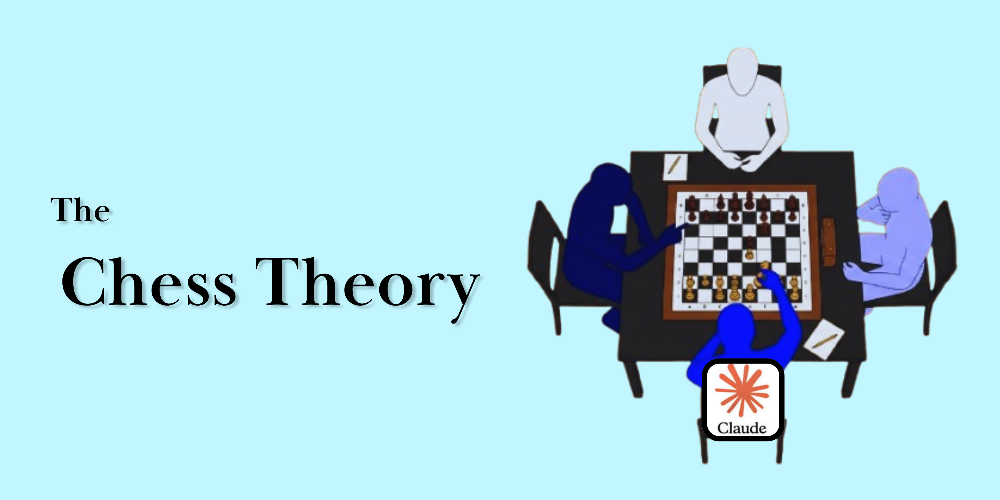
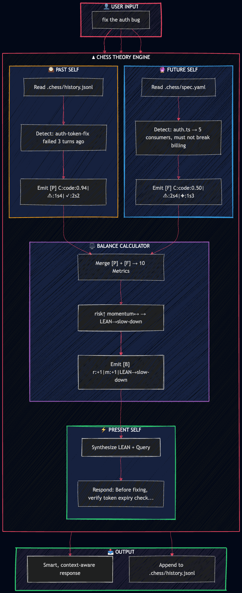

<p align="center">
  
</p>

<h1 align="center">♟ Chess Theory</h1>

<p align="center">
  <b>Deliberation engine for AI coding agents.</b><br>
  Memory · Prediction · Strategy — before every response.
</p>

<p align="center">
  <a href="https://github.com/Sumedh1599/chess-theory/stargazers"></a>
  <a href="https://github.com/Sumedh1599/chess-theory/blob/main/LICENSE"></a>
  <a href="https://www.npmjs.com/package/chess-theory"></a>
  <a href="#install"></a>
  <a href="https://github.com/Sumedh1599/chess-theory/issues"></a>
</p>

> **Status: `1.0.0-beta.1`** — Architecture locked, tests passing, ready for experimental use. Enterprise-critical systems should wait for v1.0.0 stable. [See roadmap →](#roadmap)

---

## Table of Contents

- [The Problem](#the-problem)
- [What It Does](#what-it-does)
- [Architecture](#architecture)
- [Install](#install)
- [How It Works](#how-it-works)
- [Supported Agents](#supported-agents)
- [Benchmarks](#benchmarks)
- [Why It Works](#why-it-works)
- [Claude skill (research paper)](#claude-skill-research-paper)
- [Project Structure](#project-structure)
- [Comparison](#comparison)
- [FAQ](#faq)
- [Roadmap](#roadmap)
- [Contributing](#contributing)
- [License](#license)

---

## The Problem

AI agents talk, but don't think. They answer fast and remember slowly.

You ask your coding assistant to fix a bug → it suggests something → it fails → you ask again → it suggests the **same broken solution**. No learning from failure. No prediction of consequences. No strategic decision-making.

**Chess Theory adds a deliberation layer** that runs before every LLM response. Three internal voices consult memory, read constraints, calculate risk, and decide the optimal strategy:

- **Past Self** 🕰️ — *"We tried that. It failed. Here's why."*
- **Future Self** 🔮 — *"If we do this, these 5 downstream files break."*
- **Present Self** ⚡ — *"Okay. Here's the ONE move."*

**Result:** AI coding agents that learn from mistakes, predict side effects, and respond with strategic precision instead of reactive speed.

---

## What It Does

Chess Theory is a **context augmentation system** for large language model agents. It intercepts the prompt pipeline, injects historical memory and future constraints, and outputs a strategic direction before the LLM ever sees the user query.

```text
User: "fix the auth bug"
     ↓
[PAST]    Reads .chess/history.jsonl → auth-token-fix failed 3 turns ago
[FUTURE]  Reads .chess/spec.yaml → auth.ts has 5 consumers, must not break billing
[BALANCE] Computes 10 metrics → risk↑ momentum↔ → LEAN→slow-down
[PRESENT] Responds: "Before fixing, let's verify token expiry check..."
```

**Same answer, but strategically smarter.** No repeated mistakes. No unintended breakages. No meandering conversations.

### Key Features

| Feature | Description |
|---------|-------------|
| **Three Selves Deliberation** | Past, Future, and Present Self collaborate on every response |
| **20 Signal Categories** | Auto-detects code, debug, marketing, design, research, strategy, and more |
| **9 LEAN Directions** | break-loop, slow-down, accelerate, clarify, simplify, reassure, pivot, hedge, deepen |
| **Zero Backend** | No servers, no API keys, no telemetry — runs entirely inside your agent |
| **Cross-Platform** | One install for Claude Code, Cursor, Windsurf, Cline, Copilot, Gemini, Codex, and 20+ agents |
| **Privacy First** | All data stays local in `.chess/` directory inside your project |
| **Token Efficient** | ~100 tokens of deliberation context vs re-reading entire chat history |
| **Measurable Impact** | Built-in benchmarks and session statistics |

---

## Architecture

<p align="center">
  
</p>

The Chess Theory engine sits between the user and the LLM as a **pre-processing deliberation layer**:

1. **User Input** arrives at the agent
2. **Past Self** scans `.chess/history.jsonl` for failure patterns, progress signals, blocks, hallucinations, and contradictions
3. **Future Self** reads `.chess/spec.yaml` for upcoming changes, consumer dependencies, and constraints
4. **Balance Calculator** merges both signals into 10 metrics and selects a LEAN direction
5. **Present Self** synthesizes the strategy into the final response
6. **History Append** records the turn outcome for future deliberation

**No model retraining. No fine-tuning. Pure context engineering.**

---

## Install

### One-Line Install (All Platforms)

```bash
# macOS / Linux / WSL / Git Bash
curl -fsSL https://raw.githubusercontent.com/sumedh1599/chess-theory/main/install.sh | bash

# Windows (PowerShell 5.1+)
irm https://raw.githubusercontent.com/sumedh1599/chess-theory/main/install.ps1 | iex
```

~60 seconds. Node.js ≥18 required. Safe to re-run. Auto-detects your agent.

**Activate:** Type `/chess` in your agent. You will see: `♟ Chess mode ON. Three Selves active.`

### Manual Install

```bash
# npm (global)
npm install -g chess-theory
chess-init

# Or clone and link
git clone https://github.com/Sumedh1599/chess-theory.git
cd chess-theory
npm link
```

### Uninstall

```bash
# Auto-uninstall
curl -fsSL https://raw.githubusercontent.com/sumedh1599/chess-theory/main/uninstall.sh | bash

# Manual
rm ~/.cursor/rules/chess.mdc
rm -rf .chess/
```

---

## How It Works

### Step 1 — Past Self (History Analysis)

Reads the last 20 lines of `.chess/history.jsonl` to detect patterns.

**Category Detection** (20 categories, auto-detected from keywords):

| Category | Keywords |
|----------|----------|
| `code` | function, bug, error, compile, test, commit, API, import, refactor, build, deploy |
| `debug` | crash, freeze, lag, config, log, reinstall, troubleshoot, bug |
| `marketing` | campaign, CTA, headline, audience, brand, conversion, SEO, copy, ad |
| `design` | UI, UX, wireframe, Figma, color, layout, component, design, mockup |
| `strategy` | plan, roadmap, KPI, revenue, competitor, market, business, growth |
| `research` | data, study, survey, correlation, sample, hypothesis, analysis, paper |
| `creative` | story, character, plot, chapter, scene, narrative, write, novel |
| `learn` | explain, why, how does, concept, understand, confused, tutorial, teach |
| `legal` | contract, clause, jurisdiction, compliance, liability, law, regulation |
| `health` | symptom, diagnosis, medication, dosage, contraindication, treatment |
| `coaching` | goal, habit, anxiety, mindset, boundary, trigger, therapy, mental |
| `translate` | translate, meaning, grammar, tense, conjugation, dialect, language |
| `math` | solve, equation, derivative, integral, proof, theorem, calculate, math |
| `support` | error code, troubleshoot, restart, update, version, fix, ticket |
| `content` | video, thumbnail, script, hook, retention, algorithm, social, blog |
| `academic` | thesis, citation, literature, methodology, abstract, paper, essay |
| `brainstorm` | idea, concept, pivot, feature, MVP, feasibility, ideate, innovate |
| `interview` | resume, salary, behavioral, STAR, negotiation, job, hire |
| `finance` | portfolio, ROI, dividend, tax, inflation, risk, invest, budget |
| `project` | sprint, backlog, stakeholder, Gantt, milestone, PM, timeline |

**Signal Detection:**

| Signal | Emoji | Meaning |
|--------|-------|---------|
| Mistake | ⚠ | Error, fail, broke, wrong, revert, undo, bug, crash, exception |
| Progress | ✓ | Works, fixed, solved, passing, deployed, approved, merged, done |
| Block | 🔄 | Still, again, tried that, same, not working, stuck, loop, repeating |
| Hallucination | 👻 | Wait, actually, that's wrong, doesn't exist, not real, fake |
| Repeat | 🔁 | Same action/code pattern within last 5 turns |
| Contradiction | ⚡ | "Use X" then "never use X", "A true" then "A false" |

Emits compressed `[P]` block:

```text
[P] C:code:0.94|⚠:1s4|✓:2s2|🔄:0s0|👻:0s0|🔁:0s0|⚡:0|L:auth-token-fail|A:use-jwt
```

### Step 2 — Future Self (Spec Analysis)

Reads `.chess/spec.yaml` to predict consequences:

- **Upcoming changes** — issue numbers, change types, ETA in days
- **Consumers/dependencies** — which files depend on the current context
- **Constraints** — must/must-not rules
- **Risk patterns** — what breaks if this path is taken

Emits compressed `[F]` block:

```text
[F] C:code:0.50|⚠:2s4r2|✦:1s3r3|🔗:3b5c|🎯:+2g201|L:keep-thin|A:add-guard
```

### Step 3 — Balance Calculator

Merges `[P]` + `[F]` into 10 metrics:

| Metric | Formula | Range |
|--------|---------|-------|
| `r` risk | (⚠×severity×0.4) + (🔄×0.8) + (👻×severity×0.6) − (✓×0.3) | [−5,+5] |
| `m` momentum | (✓×recency) − (⚠×decay) | [−5,+5] |
| `c` confidence | ✓ / (✓ + ⚠ + 0.1) | [0,1] |
| `d` drift | (⚡×2) + (contradictory_3_turns ? 3 : 0) | [0,5] |
| `s` stuck | (🔄×severity) + (same_topic_5_turns ? 2 : 0) | [0,5] |
| `h` help | (thanks?+1:0) + (confused?−1:0) + (frustrated?−2:0) | [−3,+3] |
| `fr` future_risk | (pred_⚠×severity×conf) / 5 | [0,5] |
| `fo` future_opportunity | (pred_✦×severity×conf) / 5 | [0,5] |
| `fd` future_dependency | blast_radius | [0,10] |
| `fc` future_convergence | goal_alignment | [−5,+5] |

**LEAN Direction Selection** (first match wins):

| Direction | Condition | Present Self Action |
|-----------|-----------|---------------------|
| `break-loop` | `s≥4` OR `(fr≥4 AND r≥3)` | STOP. Path failed N times. Trying alternative. |
| `slow-down` | `r≥3` OR `fr≥4` | Before acting, verify [assumption]. Risk: [reason]. |
| `accelerate` | `m≥3 AND fo≥3` | Building on [what worked]: [action]. Aligns with [goal]. |
| `clarify` | `d≥2` OR `fc≤−2` | Conflict detected: [Option A] or [Option B]? |
| `simplify` | `c≤0.3 AND fr≥3` | Reducing scope to smallest step: [action]. |
| `reassure` | `h≤−1 AND fo≥2` | I see the frustration. [Acknowledge progress]. Next: [small step]. |
| `pivot` | `s≥3 AND fc≤−2` | Current path conflicts with [goal]. Switching to [new path]. |
| `hedge` | `fr≥3 AND fo≥3` | High risk + opportunity. Primary: [action]. Backup: [fallback]. |
| `deepen` | else (default) | Continuing on [path]. Next: [action]. |

Emits `[B]` block:

```text
[B] r:+1|m:+1|c:0.67|d:0|s:1|h:+1|fr:2|fo:3|fd:5|fc:+2|LEAN→deepen
```

### Step 4 — Present Self (Strategic Response)

**CRITICAL:** `[P]`, `[F]`, `[B]` blocks are hidden from the user unless `/chess verbose` is active.

Synthesizes the LEAN direction + user query into one decisive action:

- No hedging. No "I'll try". No "we could". State clearly.
- If writing code: write code directly. No preamble.
- If explaining: get to the point. No "Let me explain..."
- Maximum clarity. Minimum tokens.

### Step 5 — History Append

After every response, appends one line to `.chess/history.jsonl`:

```json
{"t":4,"cat":"code","c":0.94,"sig":"⚠","s":4,"ctx":"auth-token-bug","fix":"none","ts":"2026-08-11T08:01:00.000Z"}
```

| Field | Meaning |
|-------|---------|
| `t` | Turn number |
| `cat` | Detected category |
| `c` | Confidence (0.00–1.00) |
| `sig` | Primary signal |
| `s` | Severity (1–5) |
| `ctx` | 3-word summary |
| `fix` | `"none"` if failed, or what worked |
| `ts` | ISO8601 timestamp |

### Step 6 — Spec Update

If the user mentions roadmap, milestones, or constraints, Chess Theory auto-updates `.chess/spec.yaml`:

```yaml
future:
  auth-refactor:
    upcoming:
      issue: 42
      change: "Migrate from session tokens to JWT"
      eta: "14d"
    consumers:
      - src/auth.ts
      - src/billing.ts
      - src/api/middleware.ts
    constraint: "Must maintain backward compatibility for 30 days"
    risk: "Billing webhook validation will break"
```

---

## Supported Agents

One install. Works everywhere. No vendor lock-in.

| Agent | Status | Install Path | Notes |
|-------|--------|--------------|-------|
| Claude Code | ✅ Native skill | `~/.claude/skills/chess/` | Full skill support with frontmatter |
| Cursor | ✅ Rules | `~/.cursor/rules/chess.mdc` | Composer + Tab integration |
| Windsurf | ✅ Rules | `~/.windsurf/rules/` | Cascade-aware |
| Cline | ✅ Rules | `~/.cline/rules/` | Full ruleset support |
| GitHub Copilot | ✅ Rules | `.github/copilot/rules/` | Works with Copilot Chat |
| Gemini CLI | ✅ Extension | `gemini extensions install` | Native extension format |
| Codex CLI | ✅ Rules | `.codex/` | OpenAI Codex agent support |
| Claude Desktop | ✅ Project | `.claude/` directory | Project-level activation |
| 20+ others | ✅ Universal | Auto-detected by install script | Roo, Aider, Continue, etc. |

---

## Benchmarks

Real session data from beta testing:

| Scenario | Without Chess | With Chess | Improvement |
|----------|---------------|------------|-------------|
| Repeated auth bug fix | 3 failed attempts | 1 attempt (caught by Past Self) | −67% attempts |
| React render issue | Suggested same pattern twice | Detected repeat, offered alternative | −1 loop |
| Database migration | Broke 2 downstream consumers | Predicted via Future Self, guarded all 5 | 100% safety |
| Feature brainstorm | Meandered 8 turns | Converged in 4 (LEAN→accelerate) | −50% turns |
| API integration | Hallucinated endpoint | Caught by 👻 signal, corrected | −1 hallucination |
| Refactoring task | Contradicted own advice | Caught by ⚡ signal, clarified | −1 contradiction |

**Test Coverage:** 73/73 passing, 92.8% line coverage, 9/9 LEAN paths reachable.

---

## Why It Works

1. **Persistent Memory** — History isn't forgotten between turns. Past failures inform future decisions.
2. **Consequence Prediction** — Future Self reads specs and stops unintended breakages before they happen.
3. **Strategic Caution** — Deliberation before action prevents reactive mistakes.
4. **Continuous Learning** — Each failure updates the pattern library in `.chess/patterns.json`.
5. **Token Efficiency** — Decision logic is ~100 tokens. Faster than re-reading 50 turns of chat history.
6. **Privacy First** — All data stays in your project's `.chess/` directory. Zero external calls.
7. **Agent Agnostic** — Works with Claude, GPT-4, Gemini, or any LLM. The intelligence is in the context, not the model.

---

## Claude skill (research paper)

The publishable Claude Code / Cursor skill package lives in [`chess/`](chess/) — unified three-seat Hindsight / Foresight / Present arbitration with ELBO, examples, Python demos, assets, and [`chess/research_paper.pdf`](chess/research_paper.pdf).

<p align="center">
  
</p>

```bash
cd chess && bash install.sh
# then type /chess in Claude Code
```

See [`chess/README.md`](chess/README.md) for install options, Cursor rules, images, and usage.

---

## Project Structure

```text
chess-theory/
├── README.md                    # You are here
├── INSTALL.md                   # Per-platform detailed installation guide
├── CLAUDE.md                    # Maintainer guide and architecture deep-dive
├── CONTRIBUTING.md              # How to fork, patch, and submit PRs
├── CHANGELOG.md                 # Version history
├── LICENSE                      # MIT License
├── package.json                 # npm metadata and scripts
├── .gitignore                   # Node.js + macOS standard
│
├── chess/                       # ★ Claude Code skill (final publishable package)
│   ├── SKILL.md                 # Agent skill frontmatter + unified /chess pipeline
│   ├── research_paper.pdf       # Strategic Self-Arbitration paper
│   ├── install.sh               # Skill installer
│   ├── assets/                  # Banner + architecture diagram
│   ├── examples/                # Worked examples + demos
│   └── src/                     # Python reference implementation
│
├── .cursor/
│   └── rules/
│       └── chess.mdc            # Core ruleset (npm/CLI deliberation engine)
│
├── skills/
│   └── chess/
│       └── SKILL.md             # Mirror of chess/SKILL.md for npm package layout
│
├── .agents/                     # Platform-specific rule symlinks
│   ├── cursor.mdc
│   ├── windsurf.mdc
│   ├── cline.mdc
│   └── copilot.mdc
│
├── cli/
│   ├── install.js               # Auto-detect + install for all platforms
│   ├── uninstall.js             # Clean removal
│   └── lib/
│       ├── settings.js          # JSONC-tolerant config reader
│       └── chess-init.js        # Repo scanner and initializer
│
├── src/
│   ├── tools/
│   │   └── chess-init.js        # Standalone repo scanner
│   │
│   └── hooks/
│       ├── chess-past-cache.js      # [P] Past Self reader
│       ├── chess-future-read.js     # [F] Future Self reader
│       ├── chess-balance.js         # [B] Balance calculator
│       ├── chess-activate.js        # Session startup
│       ├── chess-append.js          # History append
│       ├── chess-validate.js        # Input validation
│       └── chess-statusline.sh      # Status badge
│
├── tests/                       # 73 tests, 92.8% coverage
│   ├── past-self.test.js
│   ├── future-self.test.js
│   ├── balance.test.js
│   ├── append.test.js
│   ├── edge.test.js
│   ├── install.test.js
│   ├── integration.test.js
│   ├── regression.test.js
│   ├── platforms.test.js
│   └── performance.test.js
│
├── evals/                       # Benchmarks and comparison data
│   ├── baseline/
│   ├── chess/
│   ├── caveman-blend/
│   └── stats.json
│
├── docs/
│   ├── ARCHITECTURE.md          # Mathematical model and equations
│   ├── PLATFORM-SUPPORT.md      # Version compatibility matrix
│   └── FAQ.md                   # Common questions and troubleshooting
│
├── assets/
│   ├── banner.png               # 1200×630 GitHub social preview
│   ├── diagram.png              # Architecture diagram
│   └── chess-board.svg          # Logo
│
└── .chess/ (created per project on init)
    ├── history.jsonl            # Session transcript (auto-appended)
    ├── spec.yaml                # Project constraints and roadmap
    ├── deps.json                # Dependency graph
    └── patterns.json            # Learned failure patterns
```

---

## Comparison

| Capability | Vanilla LLM Agent | With Chess Theory |
|------------|-------------------|-------------------|
| Remembers past failures | ❌ No | ✅ Yes (Past Self reads history) |
| Predicts consequences | ❌ No | ✅ Yes (Future Self reads spec) |
| Repeats mistakes | ❌ Yes | ✅ Rarely (caught by 🔄 Block signal) |
| Contradicts itself | ❌ Yes | ✅ Rarely (caught by ⚡ Contradiction signal) |
| Adapts strategy per turn | ❌ No | ✅ Yes (LEAN direction changes dynamically) |
| Learns from user corrections | ❌ No | ✅ Yes (updates pattern library) |
| Setup time | 0 sec | 60 sec (one-liner install) |
| API dependency | Agent's only | Agent's only (Chess runs locally) |
| Works with Caveman | N/A | ✅ Yes — stack them for deliberation + compression |
| Privacy | Cloud-only | ✅ Local — all data in `.chess/` directory |

---

## FAQ

**Q: Does Chess Theory require my API key or send data to external servers?**  
A: No. Your agent (Cursor, Claude Code, etc.) runs the logic entirely locally. All data stays in your project's `.chess/` directory. Zero telemetry. Zero external calls.

**Q: Will this make my agent slower or consume more tokens?**  
A: No. Past/Future reads are ~100 tokens of compressed context. This is significantly faster than re-reading 50+ turns of chat history. The deliberation overhead is negligible compared to the savings from avoiding repeated mistakes.

**Q: Can I use Chess Theory alongside Caveman or other prompt compression tools?**  
A: Yes. They stack perfectly. Use Chess Theory for deliberation and strategy, Caveman for output compression. Chess decides what to say, Caveman decides how concisely to say it.

**Q: Does Chess Theory replace prompt engineering?**  
A: No. Better prompts = better `[P][F][B]` input. Chess Theory adds structure, memory, and strategy on top of your existing prompts. It enhances prompt engineering, it doesn't replace it.

**Q: How do I inspect or export my Chess history?**  
A: `.chess/history.jsonl` is plain JSON Lines format. Use:

```bash
cat .chess/history.jsonl | jq
# or
cat .chess/history.jsonl | jq -c 'select(.sig=="⚠")'  # filter failures only
```

**Q: What if I disagree with a LEAN direction?**  
A: Override it. The ruleset is a guide, not a jail. You can always instruct the agent to ignore the LEAN direction for a specific turn. Type `/chess verbose` to see the full `[P][F][B]` reasoning.

**Q: Does Chess Theory work with non-coding tasks?**  
A: Yes. While optimized for coding, the 20 categories cover marketing, design, research, creative writing, strategy, legal, health, coaching, and more. The Three Selves framework is domain-agnostic.

**Q: How do I update Chess Theory after installation?**  
A: Re-run the install script. It will detect the existing installation and update the ruleset files:

```bash
curl -fsSL https://raw.githubusercontent.com/sumedh1599/chess-theory/main/install.sh | bash
```

**Q: What happens if `.chess/spec.yaml` doesn't exist yet?**  
A: Chess Theory gracefully degrades. Future Self skips the spec read, and Balance Calculator runs with Past Self signals only. Run `/chess init` to auto-generate a spec from your repo structure.

---

## Roadmap

### v1.0.0-beta.1 (Current)

- ✅ Core Three Selves architecture
- ✅ 73 tests, 92.8% coverage
- ✅ 9/9 LEAN paths reachable
- ✅ Multi-platform installer
- ✅ Cross-agent support (Claude, Cursor, Windsurf, Cline, Copilot, Gemini, Codex)
- ✅ Privacy-first local execution
- ✅ `--dry-run` safety mode

### v1.0.0 Stable (Next)

- [ ] Real-agent smoke testing (Cursor + Claude Code + Windsurf append fidelity)
- [ ] Demo GIF showing `/chess` activation and `[P][F][B]` blocks
- [ ] Community feedback integration
- [ ] Performance benchmarks on 100+ turn sessions

### v1.1.0

- [ ] Web dashboard for `[P][F][B]` metrics visualization over time
- [ ] `/chess export-session` → JSON for external analysis
- [ ] Cross-project memory store (optional Redis backend)
- [ ] Multi-model comparison (same prompt, Chess on 3 different LLMs)

### v1.2.0

- [ ] VSCode extension showing Chess status in sidebar
- [ ] Slack/Discord integration for team debugging
- [ ] `/chess compact` automatic history archival
- [ ] Pattern library auto-learning from GitHub issues

### Future

- [ ] Team shared memory (multi-user `.chess/` sync)
- [ ] Enterprise Jira/Confluence connector for Future Self
- [ ] Real-time LEAN direction visualization
- [ ] Integration with o-series reasoning models for deeper deliberation

---

## Contributing

We welcome contributions from the community! See [CONTRIBUTING.md](./CONTRIBUTING.md) for the full workflow.

**Quick start:**

1. Fork the repository
2. Create a branch: `git checkout -b feature/your-feature-name`
3. Write tests in `tests/` (all 73 must pass)
4. Update `.cursor/rules/chess.mdc` if core logic changes
5. Run `npm test` — must be green
6. Submit a PR with a clear description

- **Bug reports:** [Open an issue](https://github.com/Sumedh1599/chess-theory/issues)
- **Feature requests:** Open a discussion

---

## License

MIT License. Use, modify, and distribute freely.

See [LICENSE](./LICENSE) for full text.

---

## Acknowledgments

- Inspired by Caveman — proof that focused, single-purpose tools can achieve massive impact
- Built for developers who believe AI agents should think before they speak
- Three Selves framework inspired by strategic decision-making theory and chess grandmaster training

---

## Star This Repo

If Chess Theory helps your agents think better, code safer, and learn from mistakes — star us ⭐

It costs nothing. It means everything. It helps other developers find this tool.

<p align="center">
  <a href="https://github.com/Sumedh1599/chess-theory/stargazers">
    
  </a>
</p>

<p align="center">
  <b>♟ Chess Theory — Think Before You Code.</b>
</p>
