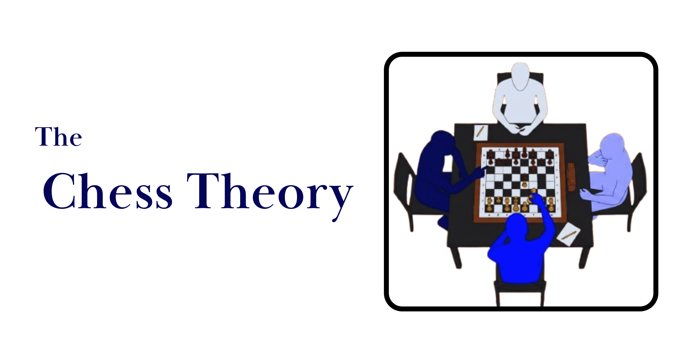

# CHESS — Claude Code Skill

<p align="center">
  
</p>

> **C**alibrated **H**indsight-**F**oresight **E**nsemble for **S**trategic **S**elf-arbitration

A Claude Code skill implementing the three-seat meta-cognitive architecture from
[*Strategic Self-Arbitration in LLM Agents*](research_paper.pdf) (Patil, 2026).

<p align="center">
  
</p>

## What This Does

CHESS makes the agent explicitly arbitrate between:

| Seat | Role | Signal |
|------|------|--------|
| **Hindsight** (Past Self) | Memory of what worked / failed | `H(t)` |
| **Foresight** (Future Self) | Candidate next actions | `F(t)` |
| **Present Self** | Variational inference → pick `a*` | ELBO / weights `w_h`, `w_f` |

Instead of greedily accepting the first candidate or averaging opinions blindly,
CHESS dynamically weights each adviser based on contribution to the Evidence Lower Bound (ELBO).

## Install (Claude Code skill)

### Option 1 — Installer script (recommended)

```bash
git clone https://github.com/Sumedh1599/chess-theory.git
cd chess-theory/chess
bash install.sh
```

This copies the skill into `~/.claude/skills/chess/` (and Cursor / Codex / Cline / Windsurf skill dirs when those agents are present).

### Option 2 — Manual copy (project-local)

```bash
mkdir -p .claude/skills/chess
cp -R SKILL.md hindsight.md foresight.md arbitration.md examples scripts src assets research_paper.pdf .claude/skills/chess/
```

### Option 3 — Personal skills (global)

```bash
mkdir -p ~/.claude/skills/chess
cp -R SKILL.md hindsight.md foresight.md arbitration.md examples scripts src assets research_paper.pdf ~/.claude/skills/chess/
```

After install, open Claude Code (or a compatible agent) and type **`/chess`**.

## Usage

| Command | What it does |
|---------|--------------|
| `/chess` or `/chess-board` | Analyze board state (context, weights, signals) |
| `/chess-hindsight` | Generate compressed hindsight signal `H(t)` |
| `/chess-foresight` | Generate `k` candidate continuations `F(t)` |
| `/chess-arbitrate` | Run full variational arbitration |
| `/chess-elbo` | Show ELBO convergence trajectory |

See [`SKILL.md`](SKILL.md) for the full protocol.

## Optional: Python reference implementation

The `src/` package mirrors the paper’s H1–H3 machinery (not required for the skill to load in Claude).

```bash
pip install -r requirements.txt
python examples/basic_usage.py
python scripts/elbo.py --candidates 3 --steps 10
python examples/h1_positional_retrieval.py
python examples/h2_hindsight_injection.py
python examples/h3_arbitration.py
```

## File structure

```
chess/
├── SKILL.md                 # Required — frontmatter + agent instructions
├── README.md                # This file
├── LICENSE                  # MIT
├── research_paper.pdf       # Full research paper (keep)
├── install.sh               # One-shot skill installer
├── requirements.txt         # Optional Python deps (numpy, scipy)
├── hindsight.md             # Hindsight compression protocol
├── foresight.md             # Candidate generation rubric
├── arbitration.md           # Variational inference guide
├── assets/
│   ├── banner.png           # Hero banner
│   ├── diagram.png          # Three-seat architecture
│   └── chess-board.svg      # Logo mark
├── examples/                # Conflict worked examples + experiment demos
├── scripts/
│   └── elbo.py              # ELBO convergence checker
└── src/                     # Python reference implementation
    ├── chess_core.py
    └── experiments.py
```

## Key results from the paper

Full write-up: [`research_paper.pdf`](research_paper.pdf)

| Hypothesis | Finding |
|-----------|---------|
| **H1** (board perception) | Mixed — 2/3 models retrieved perfectly; 1 showed irregular positional degradation |
| **H2** (hindsight helps) | **Strong support** — +0.56 to +0.62 uplift, p < .001 across all 3 models |
| **H3** (variational arbitration) | **Strong support** — beats greedy by 48–80pp, fixed-weight by 10–50pp |
| **H6** (dynamic allocation) | Analytical — dynamic beats static by +7.5%, random by +18.6% |

## Compatibility

This skill follows the **Agent Skills** open standard (`SKILL.md` + YAML frontmatter) and works with:

- Claude Code (primary)
- Codex CLI, Gemini CLI, Cursor, Windsurf, Cline, Copilot (via skills directories / CLI)

It can coexist with other skills in the same skills directory.

## License

MIT
